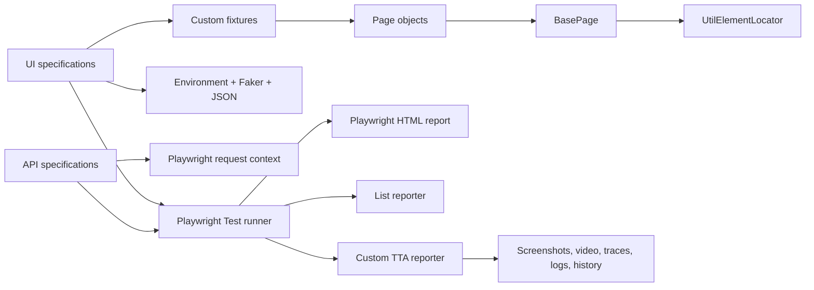

# 🎭 Advance Playwright Framework

<div align="center">
  

  <p><strong>A practical TypeScript automation framework for browser journeys, REST API checks, reusable fixtures, and rich execution reports.</strong></p>

  [](https://github.com/NiskAutomation/AdvancePlaywrightFramework/actions/workflows/playwright.yml)
  [](https://playwright.dev/)
  [](https://www.typescriptlang.org/)
  [](https://nodejs.org/)
  [](package.json)

  <sub>Built with Playwright, TypeScript, curiosity, and ❤️.</sub>
</div>

---

## Table of contents

- [Overview](#overview)
- [Architecture](#architecture)
- [Project structure](#project-structure)
- [Getting started](#getting-started)
- [Environment configuration](#environment-configuration)
- [Command reference](#command-reference)
- [Test suites](#test-suites)
- [Framework components](#framework-components)
- [Reports and artifacts](#reports-and-artifacts)
- [Continuous integration](#continuous-integration)
- [Current repository notes](#current-repository-notes)
- [Troubleshooting](#troubleshooting)
- [Contributing](#contributing)

## Overview

This repository combines UI and API automation in one Playwright Test project. It currently targets a TTACart/SauceDemo-style storefront for browser scenarios and the public Restful Booker service for API examples.

| Capability | Current implementation |
| --- | --- |
| UI automation | Chromium project with Page Object Model classes |
| API automation | Dedicated `api` project and Restful Booker specifications |
| Language | Strict TypeScript with path aliases |
| Test data | Environment variables, JSON, Faker, CSV, and Excel dependencies |
| Fixtures | Shared page-object fixtures in `src/fixtures/test-base.ts` |
| Logging | Scoped Winston loggers with console and file output |
| Reporting | Playwright HTML, list output, and a custom TTA HTML reporter |
| Evidence | Video and trace on every configured run; optional step screenshots |
| CI | GitHub Actions on pushes and pull requests to `main` or `master` |

### Runtime defaults

- Test timeout: **60 seconds**.
- Assertion timeout: **10 seconds**.
- Execution: **fully parallel**.
- Retries: **2 in CI**, otherwise **0**.
- Browser mode: **headed** (`headless: false`).
- Browser viewport: **1920 × 1080** for Chromium.
- Screenshot: disabled unless `ATTACH_SCREENSHOTS=true`, then retained on failure and attached by visual steps.
- Video: **on**.
- Trace: **on**.
- Reporters: Playwright HTML, list, and `CustomReporter.ts`.

## Architecture



The UI tests consume page objects through custom fixtures. Page objects inherit common navigation and logging behavior from `BasePage`, while `UtilElementLocator` centralizes low-level actions and waits. API tests use Playwright's request context directly.

## Project structure

```text
AdvancePlaywrightFramework/
├── .github/
│   ├── skills/                         # Reusable Playwright and explainer playbooks
│   └── workflows/
│       └── playwright.yml              # GitHub Actions workflow
├── docs/
│   └── LIBRARIES.md                    # Library notes
├── Learning/                           # Implementation and learning notes
├── logs/                               # Winston runtime logs
├── reports/
│   └── runs/                           # Custom reporter build snapshots
├── src/
│   ├── api/
│   │   └── 01_restfulbooker_raw/       # Ping, POST, context, PUT, and CRUD API tests
│   ├── config/
│   │   ├── credentials.ts              # Environment-backed UI credentials
│   │   └── env.ts                      # Required/optional environment helpers
│   ├── fixtures/
│   │   └── test-base.ts                # Typed page-object fixtures
│   ├── pages/
│   │   ├── BasePage.ts
│   │   ├── LoginPage.ts
│   │   ├── InventoryPage.ts
│   │   ├── ItemDetailPage.ts
│   │   ├── CartPage.ts
│   │   ├── CheckoutStepOnePage.ts
│   │   ├── CheckoutStepTwoPage.ts
│   │   └── CheckoutCompletePage.ts
│   ├── testdata/
│   │   └── logintestdata.json          # Data-driven login cases
│   ├── tests/
│   │   ├── e2e/                        # Checkout journeys
│   │   └── login/                      # Login tests
│   └── utils/
│       ├── APiHelper.ts                # API helper scaffold
│       ├── CustomReporter.ts           # TTA HTML reporter
│       ├── DataGenerator.ts            # Faker-backed data generation
│       ├── logger.ts                   # Winston logger factory
│       ├── UtilElementLocator.ts       # Locator/action wrapper
│       └── VisualSteps.ts              # test.step + optional screenshots
├── tta-report/                         # Generated custom report site and evidence
├── .env                                # Local secrets; ignored by Git
├── package.json
├── package-lock.json
├── playwright.config.ts
├── tsconfig.json
└── README.md
```

## Getting started

### Prerequisites

- A current Node.js LTS release
- npm
- Git
- Chromium dependencies supported by Playwright

Verify the tools:

```bash
node --version
npm --version
git --version
```

### Clone and install

```bash
git clone https://github.com/NiskAutomation/AdvancePlaywrightFramework.git
cd AdvancePlaywrightFramework
npm ci
npx playwright install
```

Use `npm ci` for a reproducible install from `package-lock.json`. Use `npm install` when intentionally updating dependencies.

On a fresh Linux or CI host, install browsers and system dependencies together:

```bash
npx playwright install --with-deps
```

To install only Chromium:

```bash
npx playwright install chromium
```

> The project does not currently define npm scripts, so use the direct `npx playwright ...` commands documented below.

## Environment configuration

Create a `.env` file in the repository root. It is ignored by Git and must never be committed.

```dotenv
# Select a configured target: qa, dev, local, stg, stage, staging, prod,
# production, or api. BASE_URL overrides this selection when present.
TTA_ENV=qa
BASE_URL=https://your-ui-under-test.example

# Optional environment-specific UI targets
QA_BASE_URL=https://your-qa-ui.example
DEV_BASE_URL=http://localhost:3000
STG_BASE_URL=https://your-staging-ui.example
PROD_BASE_URL=https://your-production-ui.example

# API target
API_BASE_URL=https://restful-booker.herokuapp.com

# UI credentials and checkout data
STANDARD_USER=your_test_username
TTA_SECRET=your_test_password
CHECKOUT_ITEM_ID=test-allthethings-tshirt-red
CHECKOUT_FIRST_NAME=Test
CHECKOUT_LAST_NAME=User
CHECKOUT_POSTAL_CODE=560001

# Evidence and report metadata
ATTACH_SCREENSHOTS=true
TEST_ENV=QA
TEST_AUTHOR=TTA-QA
LOG_LEVEL=info
```

### Variable behavior

| Variable | Required | Purpose |
| --- | --- | --- |
| `BASE_URL` | No | Highest-priority UI base URL override |
| `TTA_ENV` | No | Chooses the `qa`, `dev/local`, `stg`, `prod`, or `api` URL branch; defaults to `qa` |
| `QA_BASE_URL` | No | QA target; falls back to `https://app.thetestingacademy.com` |
| `DEV_BASE_URL` | No | Development/local target; falls back to `http://localhost:3000` |
| `STG_BASE_URL` | No | Staging target; falls back to `https://stage.thetestingacademy.com` |
| `PROD_BASE_URL` | No | Production target; falls back to `https://app.thetestingacademy.com` |
| `API_BASE_URL` | No | API project target; falls back to Restful Booker |
| `STANDARD_USER` | For environment-driven checkout | Login username |
| `TTA_SECRET` | For environment-driven checkout | Login password/secret |
| `CHECKOUT_ITEM_ID` | For environment-driven checkout | Product ID selected during checkout |
| `CHECKOUT_FIRST_NAME` | No | Checkout first name; Faker supplies a fallback |
| `CHECKOUT_LAST_NAME` | No | Checkout last name; Faker supplies a fallback |
| `CHECKOUT_POSTAL_CODE` | No | Checkout postal code; Faker supplies a fallback |
| `ATTACH_SCREENSHOTS` | No | Set to `true` to capture screenshots in `visualStep` |
| `TEST_ENV` | No | Display label used by the custom report |
| `TEST_AUTHOR` | No | Author label displayed by the custom report |
| `LOG_LEVEL` | No | Winston logging threshold; defaults to `info` |
| `CI` | Automatic in CI | Enables two retries |

`TTA_ENV` controls URL resolution. `TEST_ENV` is separate and only labels the generated report.

### Temporary shell variables

PowerShell:

```powershell
$env:TTA_ENV = "qa"
$env:STANDARD_USER = "your_test_username"
$env:TTA_SECRET = "your_test_password"
$env:CHECKOUT_ITEM_ID = "test-allthethings-tshirt-red"
npx playwright test src/tests/e2e/e2e-checkout.spec-env.spec.ts --project=chromium
```

Bash/zsh:

```bash
export TTA_ENV=qa
export STANDARD_USER=your_test_username
export TTA_SECRET=your_test_password
export CHECKOUT_ITEM_ID=test-allthethings-tshirt-red
npx playwright test src/tests/e2e/e2e-checkout.spec-env.spec.ts --project=chromium
```

## Command reference

### Run test projects

```bash
# Run every configured project: Chromium UI + API
npx playwright test

# Run only browser tests under src/tests
npx playwright test --project=chromium

# Run only request tests under src/api
npx playwright test --project=api
```

### Run a suite, file, or test line

```bash
# Login suite
npx playwright test src/tests/login/login.spec.ts --project=chromium

# Standard checkout journey
npx playwright test src/tests/e2e/e2e-checkout.spec.ts --project=chromium

# Environment-driven checkout journey
npx playwright test src/tests/e2e/e2e-checkout.spec-env.spec.ts --project=chromium

# All Restful Booker API examples
npx playwright test src/api/01_restfulbooker_raw --project=api

# One API specification
npx playwright test src/api/01_restfulbooker_raw/05_Crud.spec.ts --project=api

# Start from a particular test declaration line
npx playwright test src/tests/e2e/e2e-checkout.spec.ts:30 --project=chromium
```

### Filter by title or tag

```bash
npx playwright test --grep "@P0"
npx playwright test --grep "@p0"
npx playwright test --grep "@Regression"
npx playwright test --grep "@Checkout"
npx playwright test --grep-invert "@FixtureExample"
```

Tag matching is case-sensitive unless the supplied regular expression says otherwise; this repository currently contains both `@P0` and `@p0`.

### Control execution

```bash
# Explicitly run with a visible browser (already the repository default)
npx playwright test --project=chromium --headed

# Interactive Playwright UI
npx playwright test --ui

# Playwright Inspector, one worker, no timeout
npx playwright test --debug

# Serial or parallel worker counts
npx playwright test --workers=1
npx playwright test --workers=4

# Retry and repetition controls
npx playwright test --retries=2
npx playwright test --repeat-each=3

# Stop early
npx playwright test --max-failures=1
npx playwright test -x

# Split a run across two jobs
npx playwright test --shard=1/2
npx playwright test --shard=2/2

# Re-run only the last failures
npx playwright test --last-failed

# Run tests changed relative to remote main
npx playwright test --only-changed=origin/main

# Discover tests without executing them
npx playwright test --list
```

### Override evidence or reporter behavior

```bash
# Force tracing for this run
npx playwright test --trace=on

# Use only the concise list reporter for this run
npx playwright test --reporter=list

# Store Playwright execution artifacts elsewhere
npx playwright test --output=test-results/custom-run
```

Passing `--reporter` overrides the reporters configured in `playwright.config.ts`, including the custom TTA reporter.

### Open reports and traces

```bash
# Open the standard Playwright HTML report
npx playwright show-report

# Inspect a trace archive
npx playwright show-trace tta-report/traces/trace_1.zip
```

Open the custom report from PowerShell:

```powershell
Start-Process .\tta-report\index.html
```

Open it on macOS or Linux:

```bash
open tta-report/index.html
xdg-open tta-report/index.html
```

### Generate and inspect tests

```bash
# Record interactions and generate starter code
npx playwright codegen https://your-ui-under-test.example

# Display the installed Playwright version
npx playwright --version

# Display every supported test-runner option
npx playwright test --help
```

### Dependency maintenance

```bash
# Install exactly what package-lock.json specifies
npm ci

# Install or refresh dependencies and update the lockfile
npm install

# Show outdated direct and transitive packages
npm outdated

# Audit known dependency vulnerabilities
npm audit
```

## Test suites

### Browser suites

| File | Coverage |
| --- | --- |
| `src/tests/login/login.spec.ts` | Opens the login page, authenticates a valid user, and verifies that the login form disappears |
| `src/tests/e2e/e2e-checkout.spec.ts` | Login → inventory → cart → checkout information → overview → order completion |
| `src/tests/e2e/e2e-checkout.spec-env.spec.ts` | Same checkout flow with required environment values and optional Faker-backed customer fields |
| `src/tests/e2e/e2e-checkout_new_fixture.spec.ts` | Example of precondition fixtures for invalid login and a preselected cart item; see the current repository note below |

### API suites

| File | Coverage |
| --- | --- |
| `01_basic_ping.spec.ts` | Service health/ping request |
| `02_post_operation.spec.ts` | Booking creation with response assertions |
| `03_newcontext_api.spec.ts` | Isolated API request context and headers |
| `04_put_operation.spec.ts` | Authenticated booking update |
| `05_Crud.spec.ts` | Serial token creation, booking creation, and update flow |

The API examples use Restful Booker as a learning/demo service. Do not reuse its demonstration credentials for real systems.

## Framework components

### Page Object Model

`BasePage` supplies the Playwright `Page`, a scoped logger, the shared locator utility, and base-URL-aware navigation. Concrete page objects own their locators and business actions:

| Page object | Main responsibilities |
| --- | --- |
| `LoginPage` | Open the app and authenticate |
| `InventoryPage` | Read products, add/remove items, open cart or item details |
| `ItemDetailPage` | Inspect an item and update cart state |
| `CartPage` | Inspect cart rows, remove items, continue shopping, begin checkout |
| `CheckoutStepOnePage` | Enter customer details and validate form errors |
| `CheckoutStepTwoPage` | Read subtotal/tax/total and finish or cancel |
| `CheckoutCompletePage` | Validate confirmation and return home |

### Typed fixtures

Import the extended runner when a test needs page-object fixtures:

```typescript
import { test, expect } from '@fixtures/test-base';

test('example', async ({ loginPage, inventoryPage, cartPage }) => {
  await loginPage.open();
  // Continue the journey with typed page objects.
});
```

### Path aliases

`tsconfig.json` defines these import aliases:

| Alias | Target |
| --- | --- |
| `@api/*` | `src/api/*` |
| `@config/*` | `src/config/*` |
| `@fixtures/*` | `src/fixtures/*` |
| `@pages/*` | `src/pages/*` |
| `@testdata/*` | `src/testdata/*` |
| `@utils/*` | `src/utils/*` |

### Utilities

- `UtilElementLocator` accepts selectors or Playwright locators and wraps clicks, fills, hover, text/value reads, waits, state checks, and select operations.
- `DataGenerator` creates credentials, names, email addresses, phone numbers, postal codes, checkout customers, and complete user profiles with Faker.
- `env.ts` provides `requireEnv`, `envOr`, and `assertEnv` for explicit configuration handling.
- `VisualSteps` combines `test.step` with optional per-step screenshot attachments.
- `logger.ts` creates global or scoped Winston loggers and writes runtime output under `logs/`.
- `APiHelper.ts` is currently an empty scaffold reserved for reusable HTTP methods.

### Installed libraries

| Package | Installed version | Purpose |
| --- | ---: | --- |
| `@playwright/test` | 1.62.1 | Test runner, browser automation, assertions, API requests |
| `@faker-js/faker` | 10.5.0 | Generated user and checkout data |
| `dotenv` | 17.4.2 | Local environment loading |
| `winston` | 3.19.0 | Structured logging |
| `ajv` / `ajv-formats` | 8.20.0 / 3.0.1 | JSON Schema validation support |
| `csv-parse` | 7.0.2 | CSV test-data support |
| `xlsx` | 0.18.5 | Excel workbook support |
| `jsonpath-plus` | 10.4.0 | JSONPath queries |
| `allure-playwright` | 3.10.2 | Installed Allure adapter; not currently registered in the reporter configuration |
| `@types/node` | 26.2.0 | Node.js TypeScript declarations |

## Reports and artifacts

### Standard Playwright report

The built-in HTML reporter writes to `playwright-report/`. Use `npx playwright show-report` to serve it locally.

### Custom TTA report

`src/utils/CustomReporter.ts` produces:

- A timestamped `tta-report/report_<run-id>.html` file.
- `tta-report/index.html`, redirected to the latest run.
- `tta-report/history.html`, listing earlier report files.
- Per-test status, duration, retry count, tags, errors, stack traces, logs, and steps.
- Copied screenshots, videos, and trace links.
- Build snapshots under `reports/runs/` for previous-vs-current flaky analysis.
- Optional AI RCA/flaky sections when compatible agent modules and provider configuration exist; otherwise it degrades gracefully and skips AI analysis.

### Artifact locations

| Path | Contents |
| --- | --- |
| `playwright-report/` | Standard Playwright HTML report |
| `test-results/` | Raw Playwright output and run attachments |
| `tta-report/` | Custom HTML reports, screenshots, videos, and copied traces |
| `reports/runs/` | Reporter build-history snapshots |
| `logs/` | Winston combined/error logs |

Generated evidence may contain URLs, application data, screenshots, request details, or user-entered values. Review it before publishing or attaching it to an issue.

## Continuous integration

`.github/workflows/playwright.yml` runs on pushes and pull requests targeting `main` or `master`.

The job performs the following commands on Ubuntu:

```bash
npm ci
npx playwright install --with-deps
cp .env.example .env
xvfb-run --auto-servernum npx playwright test
```

`xvfb-run` supplies a virtual display because the repository currently configures Chromium as headed. The workflow uploads `playwright-report/` for 30 days even when the tests fail, unless the job is cancelled.

## Current repository notes

These are current implementation facts, not hidden prerequisites:

1. `src/tests/e2e/e2e-checkout_new_fixture.spec.ts` requests `invalidLogin` and `loginWithSelectedItem`, but `src/fixtures/test-base.ts` does not yet declare those fixtures. Full Playwright discovery currently stops with an unknown-parameter error until the fixtures are implemented or the example is excluded.
2. The GitHub Actions workflow copies `.env.example`, but that file is not currently present in the repository. Add a safe placeholder-only `.env.example` before relying on the CI workflow.
3. `headless` is set to `false`. Local UI runs open a browser, while CI uses Xvfb.
4. The TypeScript compiler package is not directly declared in `devDependencies`; Playwright transpiles the test sources, but a standalone `npx tsc --noEmit` check requires adding `typescript`.

To run only a currently independent test file while the fixture example is being completed:

```bash
npx playwright test src/tests/login/login.spec.ts --project=chromium
npx playwright test src/api/01_restfulbooker_raw/01_basic_ping.spec.ts --project=api
```

## Troubleshooting

### Browser executable is missing

```bash
npx playwright install chromium
```

On Linux/CI:

```bash
npx playwright install --with-deps chromium
```

### Inspect a failing browser test

```bash
npx playwright test path/to/test.spec.ts --debug
npx playwright test path/to/test.spec.ts --trace=on
npx playwright show-trace path/to/trace.zip
```

### Tests use the wrong application

Set `BASE_URL` for an unconditional override, or set `TTA_ENV` plus the matching environment URL. Remember that `TEST_ENV` changes only the label displayed in the custom report.

### Environment-driven checkout fails before execution

Confirm that `STANDARD_USER`, `TTA_SECRET`, and `CHECKOUT_ITEM_ID` are non-empty in `.env` or the active shell.

### CI cannot copy `.env.example`

Create and commit a placeholder-only `.env.example`; never copy real credentials into it. Keep actual values in GitHub Actions secrets or environment variables.

### Custom report is not generated

Do not override the reporter with `--reporter=...`, and ensure the process can write to `tta-report/`, `reports/runs/`, and `logs/`.

## Security and repository hygiene

- Never commit `.env`, tokens, passwords, private keys, or production customer data.
- Treat traces, screenshots, videos, HTML reports, and logs as potentially sensitive.
- Use least-privilege test accounts and isolated test environments.
- Review generated artifacts before uploading them to GitHub or a ticket.
- Rotate a credential immediately if it appears in Git history or a published report.

## Contributing

```bash
git pull --rebase origin main
git switch -c feature/short-description

# Make changes and run the relevant tests.
npx playwright test path/to/test.spec.ts --project=chromium

git status
git add path/to/changed-file
git commit -m "Describe the change"
git push -u origin feature/short-description
```

Keep tests independent, prefer user-facing locators, put repeated UI behavior in page objects, keep secrets outside Git, and attach only reviewed execution evidence to pull requests.

## Documentation

- [Project library notes](docs/LIBRARIES.md)
- [Learning notes](Learning/)
- [Playwright documentation](https://playwright.dev/docs/intro)
- [Playwright Test CLI](https://playwright.dev/docs/test-cli)
- [TypeScript documentation](https://www.typescriptlang.org/docs/)
- [Faker documentation](https://fakerjs.dev/)
- [Winston documentation](https://github.com/winstonjs/winston)

## License

The package manifest declares the **ISC** license.

## Author and support

Created and maintained by **Nishikant Pradhan / [NiskAutomation](https://github.com/NiskAutomation)**.

- [Repository](https://github.com/NiskAutomation/AdvancePlaywrightFramework)
- [Report a bug](https://github.com/NiskAutomation/AdvancePlaywrightFramework/issues/new)
- [Request a feature](https://github.com/NiskAutomation/AdvancePlaywrightFramework/issues/new)

<div align="center">
  
</div>
